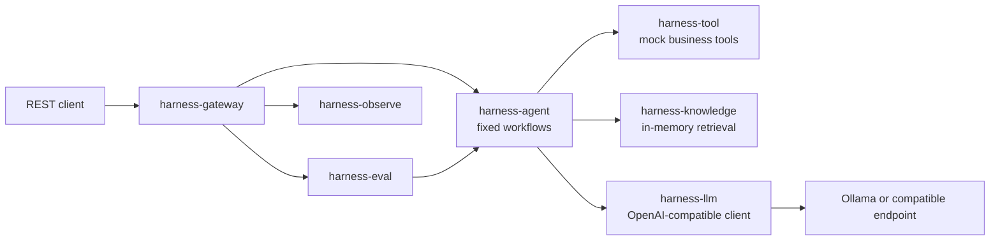

# Delivery Harness Engineering Platform

[简体中文](README.zh-CN.md) | English


[](LICENSE)

An AI harness reference implementation for on-demand delivery operations. It combines deterministic workflows, mock business tools, lightweight knowledge retrieval, an OpenAI-compatible model endpoint, evaluation scaffolding, and human-review guardrails.

> [!IMPORTANT]
> This repository is an educational MVP, not a production-ready delivery or compensation system. Business tools use synthetic data, most state is held in memory, and model output is advisory. Do not expose the application to the public internet, submit real personal/order data, or execute compensation decisions without authentication, policy enforcement, and human approval.

## What is implemented

- Two synchronous workflows: abnormal-order analysis and compensation suggestion.
- Four locally registered tools for orders, ETA, station capacity, and compensation rules. Every tool derives its result from its arguments.
- Synthetic orders that vary by order ID across six named scenarios, including one delivered on time.
- A deterministic timeline that splits an order into dispatch wait, to-shop, merchant prep, and on-road legs, reported alongside the model's answer as the baseline it has to beat.
- Compensation amounts decided by the rule engine, never by the model ([ADR-0002](docs/adr/0002-rule-engine-owns-the-compensation-amount.md)).
- OpenAI-compatible chat-completions client behind an interface, so workflows are testable without a model.
- In-memory document ingestion, text chunking, lexical retrieval scored by query-term overlap, and a rule and case base seeded at startup.
- In-memory evaluation runs whose scorers report "not measured" rather than a perfect score when a case declares no expectation.
- Request trace IDs, per-step durations, a bounded trace store, per-scenario metrics, feedback storage, and advisory output checks.
- A local Ollama profile, 95 tests, Maven Wrapper, and GitHub Actions CI.

The following are intentionally **not** claimed as implemented: autonomous agent planning, production tool integrations, durable persistence, vector embeddings/Milvus RAG, authentication, rate limiting, distributed tracing, or automatic compensation execution. See [Known limitations](#known-limitations).

## Architecture



All workflow steps run synchronously in the gateway process. Apart from the configured model endpoint, the default application has no required external services.

## Modules

| Module | Responsibility |
| --- | --- |
| `harness-common` | DTOs, exceptions, JSON/text helpers, and trace context |
| `harness-gateway` | Executable Spring Boot REST application and request logging |
| `harness-agent` | Workflow registry, two fixed workflows, timeline analysis, formatting, and advisory checks |
| `harness-tool` | Argument-driven mock tools and tool invocation records |
| `harness-llm` | Model routing, JSON extraction, and the HTTP transport behind `LlmClient` |
| `harness-knowledge` | In-memory documents, chunks, seeded rules and cases, and lexical retrieval |
| `harness-eval` | Seeded cases, synchronous evaluation runs, and lexical scorers |
| `harness-observe` | Bounded in-memory trace store, metrics, and feedback |
| `llm-inference` | Pinned Ollama container definition and smoke-test script |

Decisions that shaped this layout — including which components were deleted and why vector retrieval was not adopted — are recorded in [`docs/adr/`](docs/adr/).

## Prerequisites

- JDK 17 or newer
- Maven 3.6.3 or newer, or the included Maven Wrapper
- Docker with Compose support, only when running Ollama in a container
- Enough memory for the model you choose; `qwen2.5:7b` is the default example

## Quick start

### 1. Start a local model

If Ollama already runs on your machine, skip the first command.

```bash
docker compose up -d ollama
docker compose exec ollama ollama pull qwen2.5:7b
```

The Compose port binds to `127.0.0.1` only. Model weights are downloaded separately and are not part of this repository or its MIT license.

### 2. Build and test

```bash
./mvnw clean verify
```

### 3. Run the API

```bash
./mvnw -pl harness-gateway -am package
java -jar harness-gateway/target/harness-gateway-0.1.0-SNAPSHOT.jar
```

The API listens on `http://localhost:8080` by default.

### 4. Call a workflow

```bash
curl --fail-with-body \
  --request POST \
  --header 'Content-Type: application/json' \
  --data '{"order_id":"DEMO-001"}' \
  http://localhost:8080/api/v1/analyze/abnormal-order
```

Compensation suggestion:

```bash
curl --fail-with-body \
  --request POST \
  --header 'Content-Type: application/json' \
  --data '{"order_id":"DEMO-002","complaint_type":"OVERTIME"}' \
  http://localhost:8080/api/v1/analyze/compensation
```

Every response uses an envelope similar to:

```json
{
  "code": 0,
  "message": "success",
  "data": {
    "executionId": "...",
    "traceId": "...",
    "status": "SUCCESS",
    "steps": []
  },
  "traceId": "..."
}
```

The same trace ID is returned in the `X-Trace-Id` response header.

## API surface

| Method | Path | Purpose |
| --- | --- | --- |
| `POST` | `/api/v1/analyze/abnormal-order` | Run abnormal-order analysis |
| `POST` | `/api/v1/analyze/compensation` | Generate a compensation suggestion |
| `POST` | `/api/v1/knowledge/ingest` | Ingest and chunk an in-memory document |
| `POST` | `/api/v1/knowledge/search` | Search in-memory rules, documents, and cases |
| `POST` | `/api/v1/eval/cases` | Add an in-memory evaluation case |
| `GET` | `/api/v1/eval/cases` | List evaluation cases |
| `POST` | `/api/v1/eval/run` | Run selected cases synchronously |
| `GET` | `/api/v1/eval/run/{runId}` | Read an evaluation run |
| `GET` | `/api/v1/eval/run/{runId}/results` | Read evaluation results |
| `GET` | `/api/v1/observe/trace/{traceId}` | Read a recorded trace, when populated |
| `GET` | `/api/v1/observe/traces` | List recorded traces, when populated |
| `GET` | `/api/v1/observe/metrics` | Read in-memory metrics, when populated |
| `POST` | `/api/v1/observe/feedback` | Store feedback in memory |
| `GET` | `/api/v1/observe/feedback` | List in-memory feedback |

## Configuration

Copy `.env.example` if you want a local reference. Spring reads the following environment variables directly:

| Variable | Default | Description |
| --- | --- | --- |
| `SERVER_ADDRESS` | `127.0.0.1` | Bind address; set `0.0.0.0` only for an intentionally isolated remote/container deployment |
| `SERVER_PORT` | `8080` | API port |
| `HARNESS_LLM_ENDPOINT` | `http://localhost:11434` | OpenAI-compatible base URL |
| `HARNESS_LLM_MODEL` | `qwen2.5:7b` | Default model name |
| `HARNESS_LLM_API_KEY` | empty | Optional bearer token; never commit a real value |
| `HARNESS_LLM_TIMEOUT_SECONDS` | `120` | Model read timeout |
| `HARNESS_MAX_COMPENSATION_AMOUNT` | `50.0` | Advisory maximum amount check |

Additional Spring properties, settable in `application.yml` or as `--property=value`:

| Property | Default | Description |
| --- | --- | --- |
| `harness.compensation.approval-threshold` | `10.0` | Payouts at or above this value require a human approver |
| `harness.knowledge.seed.enabled` | `true` | Load the synthetic rule and case base at startup |
| `harness.eval.seed.enabled` | `true` | Load the starter evaluation cases at startup |
| `harness.observe.max-traces` | `500` | Size of the in-memory trace ring |

Run the model smoke test after installing the configured model:

```bash
HARNESS_LLM_MODEL=qwen2.5:7b ./llm-inference/smoke-test.sh
```

## Testing

```bash
./mvnw clean verify
```

The suite contains 95 tests. Both workflows are covered end to end against a stub model transport, so no test requires Ollama or a Docker daemon. The load-bearing test is `buildsDifferentEvidenceForDifferentOrders`: it asserts that two different orders produce two different prompts, which is the property every other measurement depends on. CI runs the same Maven verification on every push and pull request.

## Security and data handling

- There is no authentication, authorization, tenant isolation, or rate limiting.
- Tool data and addresses are synthetic examples; do not replace them with real personal data in a public deployment.
- Ingested documents can influence prompts. Treat knowledge ingestion as a prompt-injection trust boundary.
- The advisory checker detects a small set of phrases and amount conditions; it is not a policy engine.
- In-memory stores are unbounded demonstration components and are cleared on restart.
- Review [SECURITY.md](SECURITY.md) before reporting a vulnerability or deploying a derivative.

## Known limitations

- Tool implementations return synthetic data rather than calling delivery systems. The data varies with its arguments, which makes the pipeline testable — it does not make it accurate.
- Retrieval is lexical term overlap, not semantic search. CJK text is split on whitespace and punctuation rather than segmented, so recall depends on the query and the rule sharing a phrase ([ADR-0003](docs/adr/0003-no-vector-retrieval-at-this-corpus-size.md)).
- Rules, documents, cases, evaluations, feedback, metrics, and traces are not durable and are lost on restart.
- The evaluation scorers are lexical and are calibrated to catch regressions, not to certify quality. Six synthetic cases cannot establish accuracy; a real claim needs a labelled set drawn from production traffic.
- `needs_human_review` and `approval_required` are derived from guardrail outcome, parse success, model confidence and baseline agreement. This is reporting, not authority: nothing here executes a payment.
- Guardrails report pass/fail in workflow steps and the final output, but do not replace human review.
- There is no persistence layer. A prior revision shipped an unexecuted PostgreSQL schema; it was removed rather than left to imply otherwise.

## Roadmap

- Add authenticated, authorized API access and request quotas.
- Replace mock tools with versioned adapters and contract tests.
- Add durable repositories and migrations behind explicit profiles.
- Persist traces, metrics, feedback, and audit events with retention limits.
- Introduce typed workflow outputs, stronger policy enforcement, and redaction.
- Build a labelled evaluation set from real abnormal orders and measure top-1 attribution accuracy against the deterministic baseline. If the model does not beat that baseline, the model is not earning its place in the attribution path.
- Measure reviewer handling time before and after. Without it, the system cannot demonstrate that it saves anything.
- Embedding generation and vector retrieval are deliberately **not** on this roadmap at the current corpus size; see [ADR-0003](docs/adr/0003-no-vector-retrieval-at-this-corpus-size.md) for the conditions that would reopen it.

## Contributing

Contributions are welcome. Read [CONTRIBUTING.md](CONTRIBUTING.md), follow the [Code of Conduct](CODE_OF_CONDUCT.md), and use [SECURITY.md](SECURITY.md) for security-sensitive reports.

## License

The source code is licensed under the [MIT License](LICENSE). Downloaded model weights and third-party services retain their own licenses; see [THIRD_PARTY_NOTICES.md](THIRD_PARTY_NOTICES.md).
