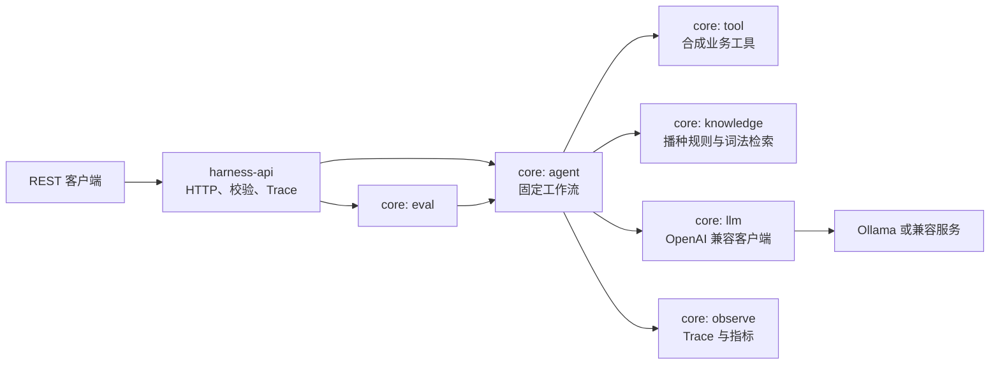

# Delivery Harness Engineering Platform

简体中文 | [English](README.md)


[](LICENSE)

面向即时配送运营场景的 AI Harness 参考实现。项目将确定性工作流、Mock 业务工具、轻量知识检索、OpenAI 兼容模型接口、评测脚手架和人工复核型安全检查组合在一起。

> [!IMPORTANT]
> 本仓库是教学与验证用途的 MVP，不是可直接投产的配送或赔付系统。业务工具使用合成数据，多数状态保存在内存中，模型输出仅供建议。请勿将应用直接暴露到公网、输入真实个人/订单数据，或在缺少鉴权、策略执行和人工审批的情况下执行赔付决策。

## 已实现能力

- 两条同步工作流：异常订单分析、赔付建议。
- 四个本地注册工具：订单、ETA、站点运力、赔付规则。每个工具的返回都由入参决定。
- 合成订单按 order_id 落到六个具名场景，其中包含一个准时送达的对照单。
- 确定性时间轴拆解（调度等待 / 到店 / 出餐等待 / 路途四段），与模型答案并列返回，作为模型必须跑赢的基线。
- 赔付金额由规则引擎决定，模型不参与定价（见 [ADR-0002](docs/adr/0002-rule-engine-owns-the-compensation-amount.md)）。
- 兼容 OpenAI Chat Completions 的客户端抽象为接口，工作流可在无模型环境下测试。
- 内存文档导入、文本切片、按查询词命中率打分的词法检索，以及开机播种的规则库与案例库。
- 内存评测运行；当用例未声明期望时，评分器报告「未度量」而不是满分。
- 请求 Trace ID、真实的分步耗时、有界 Trace 存储、按场景的指标、反馈存储和建议式输出检查。
- 本地 Ollama 配置、100 项测试、Maven Wrapper 和 GitHub Actions CI。

以下能力**尚未实现**：自主 Agent 规划、真实业务工具集成、持久化存储、向量 Embedding/Milvus RAG、鉴权、限流、分布式追踪、自动执行赔付。详见[已知限制](#已知限制)。

## 架构



所有工作流步骤都在 Gateway 进程内同步执行。除配置的模型服务外，默认应用不依赖其他外部服务。

## 模块说明

| 模块 | 实际职责 |
| --- | --- |
| `harness-common` | DTO、异常、JSON/文本工具和 Trace 上下文。无依赖。 |
| `harness-core` | 所有做决策的部分：`agent`（工作流、时间轴、Guardrail、输出格式化）、`tool`（合成业务工具）、`llm`（模型路由与传输）、`knowledge`（播种规则与案例、词法检索）、`eval`（用例、评测运行、评分器）、`observe`（Trace、指标、反馈）。 |
| `harness-api` | 可执行的 Spring Boot 应用：Controller、校验、异常映射、请求 Trace。 |
| `llm-inference` | 固定版本的 Ollama 容器定义和冒烟测试脚本 |

Java 包名没有变——`com.delivery.harness.{agent,tool,llm,knowledge,eval,observe}` 仍然存在，含义也不变。移动的只是 Maven 构建边界，见 [ADR-0004](docs/adr/0004-three-maven-modules-instead-of-nine.md)。

## 环境要求

- JDK 17 或更高版本
- Maven 3.6.3 或更高版本，也可使用仓库内置的 Maven Wrapper
- 仅在容器中运行 Ollama 时需要 Docker Compose
- 足够运行所选模型的内存；默认示例为 `qwen2.5:7b`

## 快速开始

### 1. 启动本地模型

如果本机已经运行 Ollama，可以跳过第一条命令。

```bash
docker compose up -d ollama
docker compose exec ollama ollama pull qwen2.5:7b
```

Compose 端口只绑定到 `127.0.0.1`。模型权重需要单独下载，不属于本仓库及其 MIT 许可证范围。

### 2. 构建与测试

```bash
./mvnw clean verify
```

### 3. 启动 API

```bash
./mvnw -pl harness-api -am package
java -jar harness-api/target/harness-api.jar
```

API 默认监听 `http://localhost:8080`。

### 4. 调用工作流

异常订单分析：

```bash
curl --fail-with-body \
  --request POST \
  --header 'Content-Type: application/json' \
  --data '{"order_id":"DEMO-001"}' \
  http://localhost:8080/api/v1/analyze/abnormal-order
```

赔付建议：

```bash
curl --fail-with-body \
  --request POST \
  --header 'Content-Type: application/json' \
  --data '{"order_id":"DEMO-002","complaint_type":"OVERTIME"}' \
  http://localhost:8080/api/v1/analyze/compensation
```

所有响应使用统一封装：

```json
{
  "code": 0,
  "message": "success",
  "data": {
    "executionId": "...",
    "traceId": "...",
    "status": "SUCCESS",
    "steps": []
  },
  "traceId": "..."
}
```

同一个 Trace ID 也会写入 `X-Trace-Id` 响应头。

## API 一览

| 方法 | 路径 | 用途 |
| --- | --- | --- |
| `POST` | `/api/v1/analyze/abnormal-order` | 执行异常订单分析 |
| `POST` | `/api/v1/analyze/compensation` | 生成赔付建议 |
| `POST` | `/api/v1/knowledge/ingest` | 导入并切分内存文档 |
| `POST` | `/api/v1/knowledge/search` | 检索内存规则、文档和案例 |
| `POST` | `/api/v1/eval/cases` | 添加内存评测 Case |
| `GET` | `/api/v1/eval/cases` | 查询评测 Case |
| `POST` | `/api/v1/eval/run` | 同步运行选定 Case |
| `GET` | `/api/v1/eval/run/{runId}` | 查询评测运行 |
| `GET` | `/api/v1/eval/run/{runId}/results` | 查询评测结果 |
| `GET` | `/api/v1/observe/trace/{traceId}` | 查询已记录的 Trace（如有数据） |
| `GET` | `/api/v1/observe/traces` | 查询 Trace 列表（如有数据） |
| `GET` | `/api/v1/observe/metrics` | 查询内存指标（如有数据） |
| `POST` | `/api/v1/observe/feedback` | 在内存中保存反馈 |
| `GET` | `/api/v1/observe/feedback` | 查询内存反馈 |

## 配置

如需本地配置参考，可复制 `.env.example`。Spring 会直接读取以下环境变量：

| 变量 | 默认值 | 说明 |
| --- | --- | --- |
| `SERVER_ADDRESS` | `127.0.0.1` | 绑定地址；仅在有意隔离的远程/容器部署中显式设为 `0.0.0.0` |
| `SERVER_PORT` | `8080` | API 端口 |
| `HARNESS_LLM_ENDPOINT` | `http://localhost:11434` | OpenAI 兼容服务地址 |
| `HARNESS_LLM_MODEL` | `qwen2.5:7b` | 默认模型名 |
| `HARNESS_LLM_API_KEY` | 空 | 可选 Bearer Token，禁止提交真实值 |
| `HARNESS_LLM_TIMEOUT_SECONDS` | `120` | 模型读取超时秒数 |
| `HARNESS_MAX_COMPENSATION_AMOUNT` | `50.0` | 建议式赔付金额上限检查 |

以下 Spring 配置项可在 `application.yml` 或 `--property=value` 中设置：

| 配置项 | 默认值 | 说明 |
| --- | --- | --- |
| `harness.compensation.approval-threshold` | `10.0` | 赔付金额达到该值需人工审批 |
| `harness.knowledge.seed.enabled` | `true` | 启动时载入合成规则库与案例库 |
| `harness.eval.seed.enabled` | `true` | 启动时载入初始评测用例 |
| `harness.observe.max-traces` | `500` | 内存 Trace 环形缓冲容量 |

安装模型后可运行冒烟测试：

```bash
HARNESS_LLM_MODEL=qwen2.5:7b ./llm-inference/smoke-test.sh
```

## 测试

```bash
./mvnw clean verify
```

当前共 100 项测试。两条工作流都有基于桩模型传输层的端到端覆盖，因此测试不依赖 Ollama 和 Docker。其中最关键的一条是 `buildsDifferentEvidenceForDifferentOrders`：它断言两个不同订单会产生两份不同的 Prompt——其余所有度量都建立在这个性质之上。CI 会在每次 Push 和 Pull Request 上运行同样的 Maven 校验。

## 安全与数据处理

- 当前没有鉴权、授权、租户隔离和限流。
- 工具数据与地址均为合成示例；公开部署时请勿替换为真实个人数据。
- 导入的知识内容会影响 Prompt，应将知识导入视为 Prompt Injection 信任边界。
- 建议式检查器只识别少量短语和金额条件，不是完整策略引擎。
- 内存存储无持久化，重启后数据清空；Trace 存储有容量上限，其余仍无容量治理。
- 报告漏洞或部署衍生项目之前，请阅读 [SECURITY.md](SECURITY.md)。

## 已知限制

- 工具返回合成数据，不调用真实配送系统。数据会随入参变化——这让流水线可被度量，但不代表它准确。
- 检索是词法命中率，不是语义检索。中文按空白和标点切分而非分词，召回取决于查询与规则是否共享同一短语（见 [ADR-0003](docs/adr/0003-no-vector-retrieval-at-this-corpus-size.md)）。
- 规则、文档、案例、评测、反馈、指标和 Trace 均未持久化，重启即丢失。
- 评测评分器是词法的，定位是发现回归而非认证质量。六条合成用例不足以证明准确率；真实结论需要来自线上流量的标注集。
- `needs_human_review` 与 `approval_required` 由 Guardrail 结果、解析是否成功、模型置信度和是否与基线一致推导得出。这是「如实报告」而非「授权」：系统不执行任何付款。
- Guardrail 会在工作流步骤和最终输出中返回通过/失败，但不能替代人工复核。
- 当前没有持久化层。此前版本附带过一份从不执行的 PostgreSQL Schema，已删除，以免让读者误以为持久化已存在。

## Roadmap

- 增加 API 鉴权、授权与请求配额。
- 用版本化 Adapter 和契约测试替换 Mock 工具。
- 通过显式 Profile 接入持久化 Repository 和 Migration。
- 持久化 Trace、指标、反馈和审计事件，并增加保留策略。
- 引入类型化工作流输出、更强策略执行和敏感信息脱敏。
- 用真实异常单构建标注评测集，度量 top-1 归因准确率并与确定性基线对比。若模型跑不赢基线，它就不该留在归因链路上。
- 度量人工处理时长的前后差值。没有这个数，系统无法证明自己节省了什么。
- 在当前语料规模下，Embedding 与向量检索**刻意不在** Roadmap 上；重新开启的条件见 [ADR-0003](docs/adr/0003-no-vector-retrieval-at-this-corpus-size.md)。

## 参与贡献

欢迎贡献。请阅读 [CONTRIBUTING.md](CONTRIBUTING.md)，遵守[行为准则](CODE_OF_CONDUCT.md)，安全问题请按 [SECURITY.md](SECURITY.md) 私下报告。

## 许可证

源代码使用 [MIT License](LICENSE)。单独下载的模型权重和第三方服务遵循各自许可证，详见 [THIRD_PARTY_NOTICES.md](THIRD_PARTY_NOTICES.md)。
